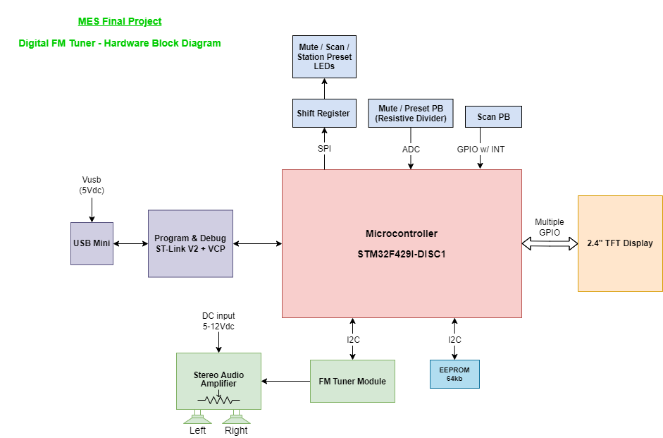

# Making_Embedded_Systems_Homeworks
A collection of material produced during the Classpert "Making Embedded Systems" course by Elecia White

# titre
## sous-titre
ceci est du texte **en gras** ou bien *en italique*
ceci est une 2e ligne

1. premier de la liste
2. dexième de la liste

- sans numéro
- toujours sans numéro

* ca marche aussi avec les étoiles
* je pense

